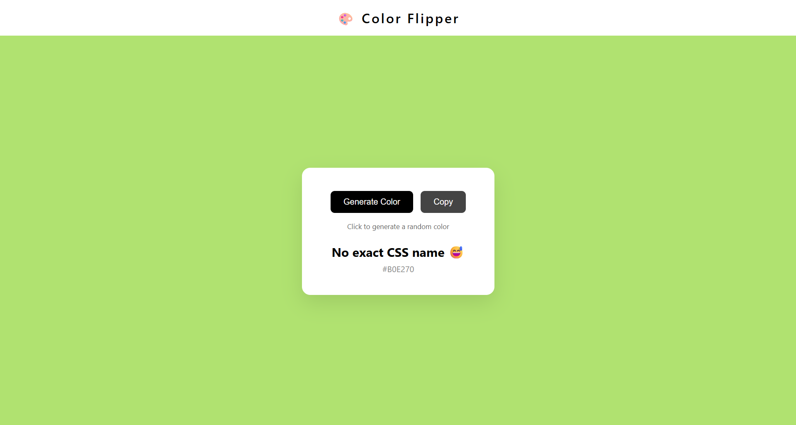

# Color Flipper
 
A simple browser app that changes the background to a random color on every button click.  
Supports both **hex colors** and **named colors**.
 


 
---
 
## 🎯 What it does
 
- Click a button → background changes to a random color
- Displays the current color value on screen
- Two modes: **hex** (e.g. `#3a1f9b`) and **named** (e.g. `cornflowerblue`)
---
 
## 📸 Preview
 
<!-- Add a screenshot here once the project is live -->

 
---
 
## 🚀 Live Demo

👉 **[View Live Project](https://Developer-Aisurya.github.io/My-Web-Projects/js-projects/color-flipper/index.html)**  
 
---
 
## 🧠 What I learned
 
- Selecting and manipulating DOM elements with `document.querySelector`
- Listening for events with `addEventListener`
- Generating random hex colors using `Math.random()`
- Dynamically updating `style` properties and text content with JavaScript
- Working with arrays to store and pick named colors
---
 
## 📁 Project structure
 
```
color-flipper/
├── index.html
├── style.css
├── script.js
└── README.md
```
 
---
 
*Part of my full-stack learning journey. See more projects → [github.com/Developer-Aisurya](https://github.com/Developer-Aisurya)*
