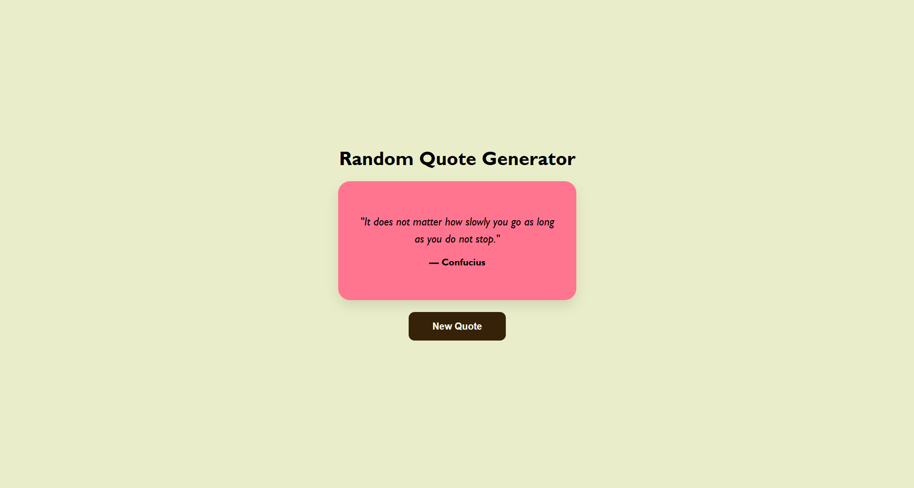

# 💬 Random Quote Generator

A sleek, responsive web application that generates inspirational quotes with dynamic background color transitions.

## 🚀 Live Demo
[Click here to view the live project](PASTE_YOUR_GITHUB_PAGES_LINK_HERE)

## 📸 Preview


## ✨ Features
- **Dynamic Quotes:** Pulls famous quotes from a curated list.
- **Synced Authors:** Ensures every quote is correctly attributed.
- **Interactive UI:** Background colors change randomly with every click.
- **Responsive Design:** Works perfectly on mobile, tablet, and desktop.

## 🛠️ Tech Stack
- **HTML5:** Semantic structure.
- **CSS3:** Flexbox layout and smooth transitions.
- **JavaScript (ES6):** DOM manipulation and randomization logic.

## 📂 How to Run Locally
1. Clone the repository:
   ```bash
   git clone [https://github.com/YOUR_USERNAME/YOUR_REPO_NAME.git](https://github.com/YOUR_USERNAME/YOUR_REPO_NAME.git)
