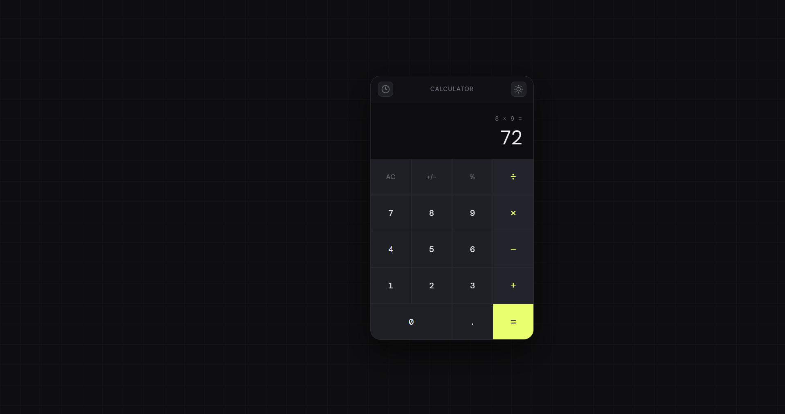

# 🧮 Calculator
 
A minimal, elegant calculator built with vanilla HTML, CSS, and JavaScript. Features a dark/light theme toggle, full calculation history, keyboard support, and smooth animations — all with zero dependencies.
 

 
---

## 🚀 Live Demo
[Click here to view the live project](https://developer-aisurya.github.io/My-Web-Projects/simple-calculator/index.html)

---
 
## ✨ Features
 
- **Clean UI** — Minimal design with a subtle grid background and monospace display font
- **Dark / Light Theme** — Toggle between themes with a single click; preference is saved to `localStorage`
- **Calculation History** — Every completed calculation is logged in a slide-in history panel; click any entry to recall its result
- **Keyboard Support** — Full keyboard input for digits, operators, Enter, Escape, and Backspace
- **Ripple Effects** — Button press animations for tactile feedback
- **Error Handling** — Divide-by-zero triggers a shake animation instead of crashing
- **Floating-Point Cleanup** — Results are formatted with `toPrecision(12)` to avoid rounding artifacts like `0.30000000004`
- **Responsive** — History panel stacks below the calculator on narrow/mobile screens
 
---
 
## 📁 File Structure
 
```
calculator/
├── index.html   # Markup and structure
├── style.css         # Theming, layout, animations
└── script.js         # Calculator logic, history, keyboard events
```
 
---

## ⌨️ Keyboard Shortcuts
 
| Key | Action |
|-----|--------|
| `0–9` | Input digit |
| `.` or `,` | Decimal point |
| `+` `-` `*` `/` | Operators |
| `Enter` or `=` | Equals |
| `Escape` | Clear (AC) |
| `Backspace` | Delete last digit |
| `%` | Percent |
 
---
 
## 🎨 Themes
 
| Token | Dark | Light |
|-------|------|-------|
| Background | `#0e0e10` | `#f0f0f3` |
| Surface | `#18181c` | `#ffffff` |
| Accent | `#e8ff6e` (lime) | `#3d7bff` (blue) |
| Text | `#f0f0f2` | `#111118` |
 
All colors are defined as CSS custom properties in `:root` and `[data-theme="light"]` blocks inside `style.css`, making it easy to customise or add new themes.
 
---
 
## 🕐 History Panel
 
- Opens and closes via the **clock icon** (top-left of the calculator)
- Displays up to **50** recent calculations, newest first
- **Click any entry** to recall that result into the display
- **Clear button** wipes the full history
 
---
 
## 🛠️ Customisation
 
**Change the accent colour** — edit the `--accent` variable in `style.css`:
```css
:root {
  --accent: #e8ff6e; /* swap for any colour */
}
```
 
**Increase history limit** — edit the cap in `script.js`:
```js
if (calcHistory.length > 50) calcHistory.shift(); // increase 50 as needed
```
 
**Adjust button height** — find `.btn` in `style.css`:
```css
.btn {
  height: 70px; /* increase or decrease */
}
```
 
---
 
## 🌐 Browser Support
 
Works in all modern browsers. No polyfills required.
 
| Browser | Support |
|---------|---------|
| Chrome / Edge | ✅ |
| Firefox | ✅ |
| Safari | ✅ |
| Mobile (iOS / Android) | ✅ |
